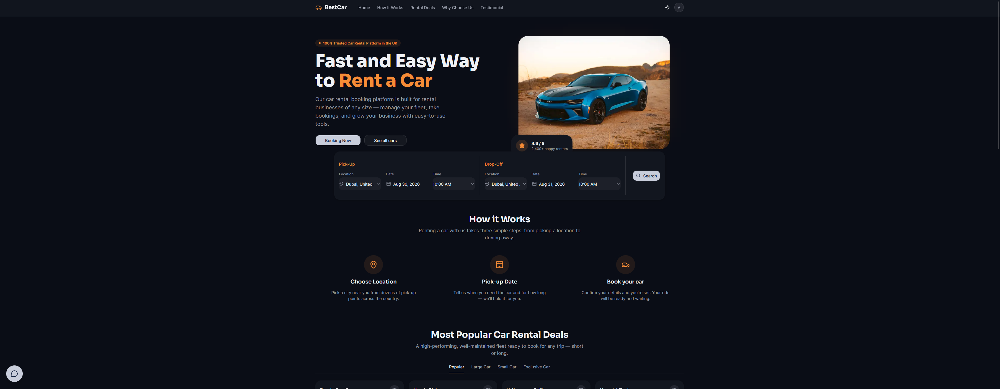
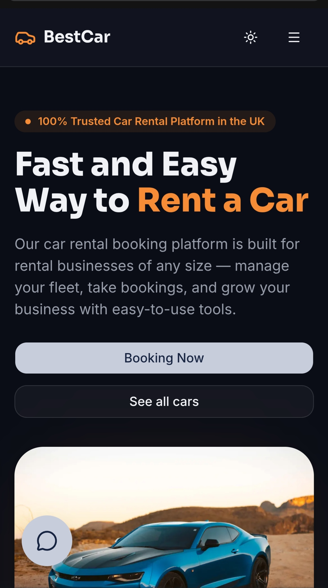
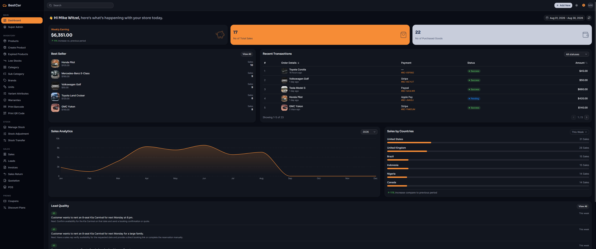
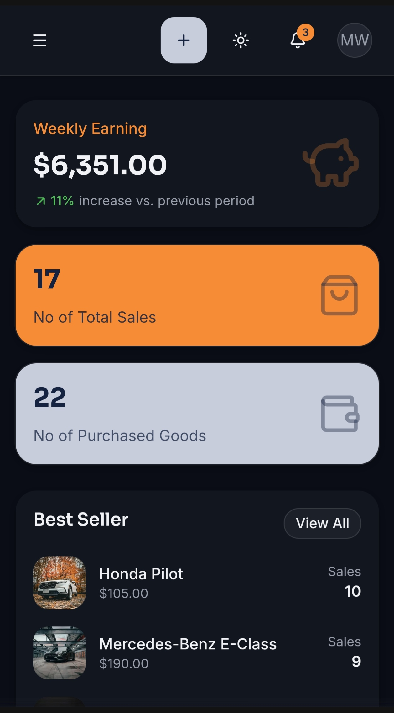
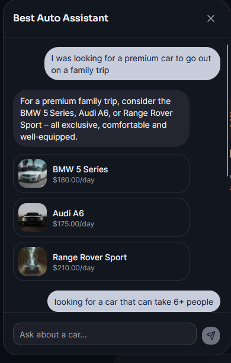
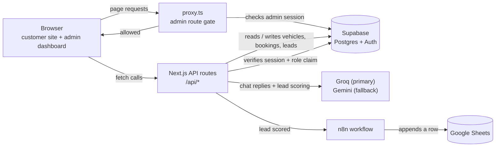
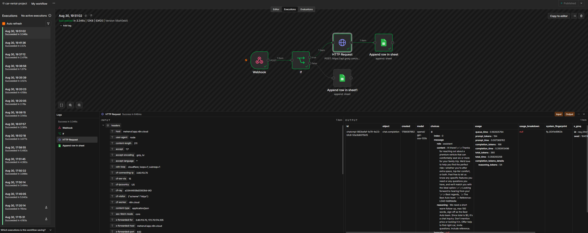
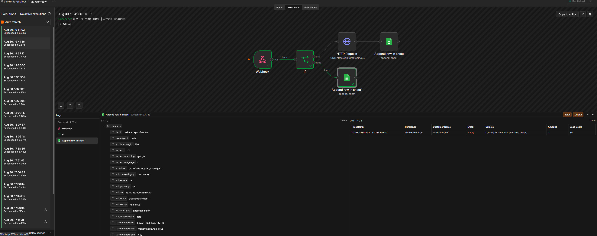
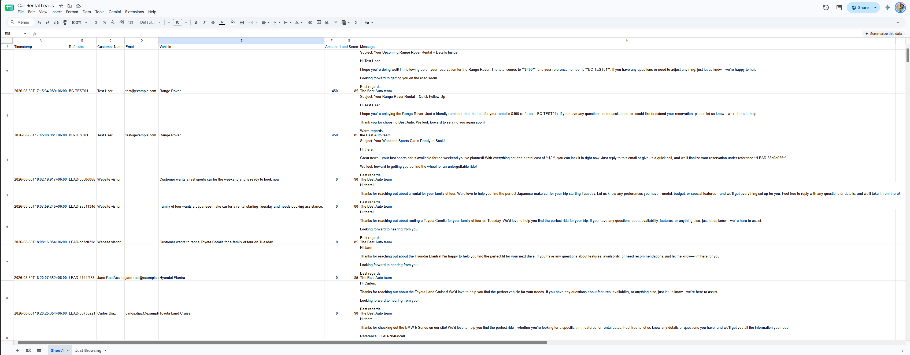

# BestCar

<div align="center">


[](LICENSE)

</div>

## 1. Project overview

BestCar is a car rental platform built as a technical assessment (Web Designer/Web Developer + AI Automation role). It has a public site where customers browse real vehicle inventory, filter by category or price, and submit a booking request, plus an admin dashboard where staff manage the fleet, review bookings, and see AI-qualified sales leads. It also includes a chat assistant on the customer site and an n8n automation that logs AI-scored leads to a Google Sheet outside the app.

## 2. Live links

- **Live site:** [Click here to go to the live site.](https://car-rental-project-mehenuf.vercel.app/)
- **Admin dashboard:** [Click here to go to the admmin page.](https://car-rental-project-mehenuf.vercel.app/admin)
- **GitHub repository:** [https://github.com/mehenuf/car-rental-project.git](https://github.com/mehenuf/car-rental-project.git)

## 3. Screenshots

**Homepage (desktop)**



**Homepage (mobile)**



**Admin dashboard (desktop)**



**Admin dashboard (mobile)**



**Chat widget in use**



## 4. Tech stack

- **Next.js 16 (App Router, Turbopack).** One project serves both the customer-facing pages and the API routes, so there is no separate backend service to deploy or keep in sync.
- **React 19 with TypeScript.** TypeScript catches a mismatch between the database schema and the UI at compile time instead of at runtime, which matters in a project with this many data-shaped tables (vehicles, bookings, leads).
- **Supabase (Postgres and Auth).** It provides a real relational database with row-level security and a built-in auth system, so sign-up, login, and session cookies did not need to be built from scratch.
- **Tailwind CSS v4.** Utility classes keep the customer site and the admin dashboard visually consistent without maintaining a separate stylesheet per component.
- **shadcn/ui on Base UI.** The dialogs, dropdowns, selects, and sheets came with keyboard navigation and focus handling already correct, which is otherwise easy to get wrong.
- **Zod.** Every API request body and query string is validated against a schema before it touches the database, so bad input returns a clear 400 error instead of a confusing crash.
- **Groq (`openai/gpt-oss-120b`) with a Gemini fallback.** Groq is fast and cheap for the chat assistant. Gemini is a second, independent provider so the chat feature keeps working if Groq has an outage.
- **Recharts.** It draws the sales analytics chart on the admin dashboard.
- **react-day-picker.** This is the calendar control used for picking pickup and drop-off dates.
- **n8n.** It listens for the lead-scoring webhook from the app and logs the result to a Google Sheet, so that part of the automation did not need its own hosted service written from scratch.
- **Vercel Analytics.** Basic page-view tracking on the deployed site.

## 5. Architecture diagram



The browser never talks to Supabase, Groq, Gemini, or n8n directly. Every one of those goes through a Next.js API route first. That route is what applies validation, checks admin permission, and keeps API keys on the server.

The app also sends a webhook on every new booking, to the same URL, but no n8n workflow currently does anything with it. Only the lead-scoring webhook has a working automation behind it, which is why the diagram above only shows that path.

## 6. Local setup

Clone the repository and install dependencies:

```bash
git clone [PASTE GITHUB REPO URL HERE]
cd car-rental-project
npm install
```

Create a `.env.local` file in the project root with the following variables:

| Variable | What it's for |
|---|---|
| `NEXT_PUBLIC_SUPABASE_URL` | The Supabase project URL. Used by both the browser client and the server. |
| `NEXT_PUBLIC_SUPABASE_ANON_KEY` | Supabase's public anon key. Safe to expose to the browser; row-level security limits what it can actually do. |
| `SUPABASE_SERVICE_ROLE_KEY` | Supabase's service-role key. This one is server-only. It bypasses row-level security, so it is used for admin writes, booking creation, and lead scoring. |
| `GROQ_API_KEY` | API key for Groq, the primary AI provider behind the chat assistant. |
| `GEMINI_API_KEY` | API key for Gemini, the automatic fallback if a Groq request fails. |
| `AUTH_REQUIRE_EMAIL_VERIFICATION` | Optional. Defaults to on: new accounts must click the emailed link (needs SMTP in Supabase). Set to `false` to create pre-confirmed accounts for demos with no email provider. |
| `RESEND_API_KEY`, `RESEND_FROM`, `RESEND_WEBHOOK_SECRET` | Optional. Send email through Resend (without them, messages are written to the console and the `notifications` table). The webhook secret verifies delivery, bounce and complaint callbacks. |
| `TWILIO_ACCOUNT_SID`, `TWILIO_AUTH_TOKEN`, `TWILIO_MESSAGING_SERVICE_SID`, `TWILIO_VERIFY_SERVICE_SID` | Optional. Text messages and phone verification through Twilio. Without the Verify service the demo accepts code 000000. |
| `VAPID_PUBLIC_KEY`, `VAPID_PRIVATE_KEY`, `VAPID_SUBJECT` | Optional. Web Push (free): generate with `npx web-push generate-vapid-keys`. |
| `NEXT_PUBLIC_SITE_URL` | The public origin, used for links inside emails and to verify Twilio webhooks. |
| `ADMIN_REQUIRE_MFA` | Optional. Staff must complete a second factor (authenticator app) to use the admin console. Defaults to on; set to `false` only for local development. |
| `CONSENT_SALT` | Secret salt used to hash IPs stored with cookie-consent records. Set a long random value in production. |
| `SENTRY_DSN` | Optional. When set, server errors are sent to Sentry (personal data scrubbed) as well as logged as JSON. |
| `QUOTE_SIGNING_SECRET` | Server-only secret (at least 32 characters) used to sign the 15 minute price quotes returned by `POST /api/quote`. Generate one with `node -e "console.log(require('crypto').randomBytes(32).toString('hex'))"`. Quoting fails without it. |
| `CRON_SECRET` | Server-only secret that protects `GET /api/cron/maintenance`. Vercel Cron sends it as `Authorization: Bearer <secret>`. Without it the endpoint answers 503. |
| `STRIPE_SECRET_KEY`, `NEXT_PUBLIC_STRIPE_PUBLISHABLE_KEY`, `STRIPE_WEBHOOK_SECRET` | Optional. Stripe **test-mode** keys and the webhook signing secret. With them, card payments go through Stripe. Without them every method is simulated and the site works the same. |
| `N8N_WEBHOOK_URL` | The n8n webhook URL that receives lead and booking events (only the lead-scoring one currently has a workflow acting on it; see section 9). This one is optional. If it is missing, the app just skips sending the webhook instead of failing. |

Build a fresh database by running `schema.sql`, then every file in `migrations/` in order (`0001` to `0011`), in the Supabase SQL editor. Never run `schema.sql` against a database that holds real data: it drops tables. Then seed it with sample branches, vehicles, fleet units and bookings:

```bash
npx tsx seed.ts
```

To give an existing account admin access:

```bash
npx tsx promote-admin.ts someone@example.com
```

Then start the dev server:

```bash
npm run dev
```

The site runs at `http://localhost:3000`, and the admin dashboard at `http://localhost:3000/admin`.

## 7. API reference

All routes live under `/api`. Routes marked **Admin only** require a logged-in session where the user's `app_metadata.role` is `"admin"`. Anyone else gets `401` with `{ "error": { "message": "Admin authentication required" } }`. Every route validates its input with Zod. An invalid request returns `400` with a list of the specific field errors.

### `GET /api/vehicles`

Public. Lists vehicles with optional filtering, sorting, and pagination.

**Query parameters:** `category` (one value or a comma-separated list, e.g. `popular,large`), `minPrice`, `maxPrice`, `seats`, `transmission` (`automatic`/`manual`), `fuel` (`petrol`/`diesel`/`hybrid`/`electric`), `available` (`true`/`false`), `locationId` (only vehicles with an active unit at that branch), `pickupLocationId` + `pickupDate` + `dropoffDate` (`YYYY-MM-DD`) with optional `dropoffLocationId` (availability search: only vehicles with a free unit for that trip), `sortBy` (`price_per_day`/`rating`/`created_at`/`name`), `sortOrder` (`asc`/`desc`), `page`, `pageSize`, `search` (matches name, brand, or slug).

**Sample response:**

```json
{
  "data": [
    {
      "id": "1e061cbc-28fb-487a-8d01-deeedb5feeb8",
      "slug": "honda-civic",
      "name": "Honda Civic",
      "brand": "Honda",
      "category": "popular",
      "price_per_day": 48,
      "seats": 5,
      "doors": 4,
      "transmission": "automatic",
      "fuel": "petrol",
      "image_url": "https://images.unsplash.com/photo-...",
      "gallery": ["https://images.unsplash.com/photo-..."],
      "description": "A reliable Honda Civic, well maintained and ready for your next trip.",
      "features": ["Reverse Camera", "Bluetooth"],
      "rating": 4.2,
      "review_count": 132,
      "stock": 3,
      "available": true,
      "location_id": 18,
      "created_at": "2026-08-29T10:55:48.134448+00:00"
    }
  ],
  "count": 24
}
```

### `POST /api/vehicles`

Admin only. Creates a vehicle.

**Body:** `slug`, `name`, `brand`, `category`, `price_per_day`, `transmission`, `fuel`, and `image_url` are required. `seats`, `doors`, `gallery`, `description`, `features`, `rating`, `review_count`, `stock`, `available`, and `location_id` are optional and fall back to database defaults. On create, `stock` is the number of fleet units to add at the vehicle's branch (`location_id`, or the first active branch); it cannot be changed with `PATCH`, since fleet size comes from the units.

**Sample response** (`201`): the created vehicle row, in the same shape as one item in `GET /api/vehicles`'s `data` array.

### `PATCH /api/vehicles`

Admin only. Updates a vehicle. The target row's `id` is sent in the request body rather than the URL.

**Body:** `id` (required) plus any subset of the same fields as create.

**Sample response:** the updated vehicle row.

### `DELETE /api/vehicles`

Admin only. Deletes a vehicle.

**Body:** `{ "id": "..." }`

**Sample response:**

```json
{ "success": true }
```

### `GET /api/vehicles/[slug]`

Public. Fetches a single vehicle by its slug.

**Sample response:** a single vehicle object, in the same shape as one item in `GET /api/vehicles`'s `data` array. Returns `404` if the slug does not match any vehicle.

### `GET /api/bookings`

Admin only. Lists bookings with the vehicle's name and image joined in.

**Query parameters:** `status` (`pending`/`confirmed`/`active`/`completed`/`cancelled`/`no_show`), `sortBy` (`created_at`/`total_amount`/`pickup_at`), `sortOrder`, `page`, `pageSize`, `startDate`, `endDate` (both `YYYY-MM-DD`, filtered on `created_at`), `search` (matches customer name or booking reference).

**Sample response:**

```json
{
  "data": [
    {
      "id": "63591cf3-771b-45be-b3ec-98a0038ee900",
      "reference": "BC-05F982",
      "vehicle_id": "0eab810e-f1d2-4ca4-8abc-6a794f7504f0",
      "customer_name": "Haffaz Aladeen",
      "email": "aladeen@example.com",
      "phone": "665332167",
      "pickup_branch_id": null,
      "dropoff_branch_id": null,
      "pickup_at": "2026-08-29T18:00:00+00:00",
      "dropoff_at": "2026-08-30T18:00:00+00:00",
      "days": 1,
      "total_amount": 45,
      "payment_method": null,
      "status": "pending",
      "lead_score": null,
      "source": "web",
      "created_at": "2026-08-29T21:28:58.304193+00:00",
      "vehicle": { "name": "Toyota Corolla", "image_url": "https://images.unsplash.com/photo-..." }
    }
  ],
  "count": 23
}
```

### `POST /api/quote`

Public, rate-limited to 30 requests per minute per visitor. Prices a trip and returns a signed token valid for 15 minutes. Answers `409` if no car is free for the dates, so an unbookable trip is never quoted.

**Body:** `vehicle_id`, `pickup_at`, `dropoff_at` are required. `pickup_branch_id`, `dropoff_branch_id` (default to the vehicle's home branch), `extras` (`[{ "code": "seat", "quantity": 1 }]`), `promo_code`, `driver_age` are optional.

**Sample response:**

```json
{
  "quote": {
    "currency": "USD",
    "days": 3,
    "lines": [
      { "kind": "base", "label": "Base rate (3 days)", "quantity": 3, "amountMinor": 14400 },
      { "kind": "weekend", "label": "Weekend rate", "amountMinor": 960 },
      { "kind": "extra", "code": "cdw", "label": "Collision damage waiver", "quantity": 1, "amountMinor": 3600 }
    ],
    "subtotalMinor": 18960,
    "taxMinor": 0,
    "serviceFeeMinor": 0,
    "totalMinor": 18960,
    "depositMinor": 20000,
    "providerPayoutMinor": 16116,
    "platformRevenueMinor": 2844,
    "cancellationTiers": [{ "hoursBefore": 48, "refundBp": 10000 }, { "hoursBefore": 0, "refundBp": 0 }]
  },
  "token": "eyJ...",
  "expires_at": "2030-03-01T10:15:00.000Z",
  "available_extras": [{ "code": "seat", "name": "Child seat", "pricing": "per_day", "unitPriceMinor": 800, "maxQuantity": 2, "isMandatory": false }]
}
```

All amounts are integer minor units (cents) of `quote.currency`. The total already contains every mandatory fee and tax; the deposit is a separate refundable hold. Billable days are whole 24 hour periods rounded up after a 59 minute grace.

### `POST /api/payments/intents`

Public, rate-limited to 10 requests per minute. Pays for the caller's own pending booking (the signed-in user or the guest cookie that created it). Repeating the same `attempt` replays the stored result, so it can never charge twice.

**Body:** `reference`, `method` (`card`, `paypal`, `apple_pay`, `google_pay`, `ideal`, `upi`, `bkash`, `mpesa`; local methods only for their country and currency), `attempt` (one id per submit of the form), `test_input` (simulated provider only).

**Response:** `{ "payment_id": "...", "status": "succeeded" | "requires_action" | "processing" | "failed", "failure_code": null, "client_secret": null }`. The refundable security deposit is authorized first (no money moves), then the charge is made. A failed charge releases the deposit hold.

Simulated test values: a card ending `0002` declines, `9995` has insufficient funds, `0069` is expired, `3220` asks for a confirmation code (`000000` approves). For other methods type `decline` or `pending`. Typing `nodeposit` makes the deposit hold fail.

### `POST /api/payments/[id]/confirm`

Completes a simulated payment that returned `requires_action`. **Body:** `{ "code": "000000" }`.

### `POST /api/bookings/[id]/cancel`

A customer cancels their own booking. The refund follows the cancellation tiers stored in the booking's price snapshot (for example free until 48 hours before pick-up, then 50%, then nothing). **Response:** `{ "refund_minor": 20000, "refund_bp": 10000, "refund_status": "none" | "succeeded" | "failed" }`. An admin cancelling through `PATCH /api/bookings/[id]` refunds in full.

### `POST /api/webhooks/stripe`

Stripe's server-to-server notifications, authenticated by the signature over the raw body (`STRIPE_WEBHOOK_SECRET`). Handles `payment_intent.succeeded` and `payment_intent.payment_failed`; every other event is acknowledged and ignored.

### `GET /api/cron/maintenance`

Protected by `CRON_SECRET`. Cancels unpaid bookings whose 15 minute hold expired (and frees their cars), releases security deposits 48 hours after completion, and pays out due provider earnings (simulated bank transfer). Every step is idempotent. `vercel.json` schedules it daily; correctness does not depend on the schedule because expired holds are also swept whenever someone quotes or books.

### `POST /api/bookings`

Public. This is what the customer-facing booking form calls. `status` and `lead_score` are deliberately not accepted here. Every new booking starts as `pending` with no score, no matter what the request contains.

**Body:** `vehicle_id`, `customer_name`, `email`, `pickup_at`, `dropoff_at` are required. `phone`, `pickup_branch_id`, `dropoff_branch_id` (both default to the vehicle's home branch; drop-off defaults to pick-up), `payment_method`, `source` (`web`/`chat`/`phone`), `extras`, `promo_code`, `driver_age` and `quote_token` (from `POST /api/quote`) are optional.

**Sample response** (`201`):

```json
{
  "id": "97fe83c3-b24f-484f-ad5b-249e39244926",
  "reference": "BC-F86688",
  "vehicle_id": "1e061cbc-28fb-487a-8d01-deeedb5feeb8",
  "customer_name": "Jane Doe",
  "email": "jane@example.com",
  "phone": "+1234567890",
  "pickup_at": "2026-09-01T10:00:00+00:00",
  "dropoff_at": "2026-09-03T10:00:00+00:00",
  "days": 2,
  "total_amount": 96,
  "payment_method": null,
  "status": "pending",
  "lead_score": null,
  "source": "web",
  "created_at": "2026-08-30T11:50:13.536378+00:00"
}
```

`total_amount` (major units) is calculated on the server by the quote engine from the vehicle's rate plan, extras, fees and taxes for that branch. It is never trusted from the client. If no unit of the vehicle is free for the dates, the response is `409`. With a `quote_token`, the server re-prices the trip and, if the total changed, answers `409` with `{ error: { code: "PRICE_CHANGED" }, quote }` instead of booking at a different price. Every booking stores the accepted quote as an immutable `price_snapshot`. A new booking is `pending` and **held for 15 minutes**; the customer is sent to `/checkout/[reference]` to pay, and payment confirms it. On success, the booking's details are also sent to the n8n webhook URL in the background, but no automation currently acts on that particular event. See section 9 for details.

### `PATCH /api/bookings/[id]`

Admin only. Changes a booking's status. This is the one place status can be set directly.

**Body:** `{ "status": "pending" | "confirmed" | "active" | "completed" | "cancelled" | "no_show" }`

Allowed moves: `pending` to `confirmed` or `cancelled`; `confirmed` to `active`, `cancelled` or `no_show`; `active` to `completed`. Anything else returns `409`. Cancelling or marking no-show frees the car for those dates; completing a one-way rental moves the car to the drop-off branch.

**Sample response:** the updated booking row, in the same shape as one item in `GET /api/bookings`'s `data` array (without the joined `vehicle` field).

### `GET /api/locations`

Public. No parameters. Powers the pickup and drop-off location dropdowns.

**Sample response:**

```json
[
  { "id": 19, "city": "Dubai", "country": "United Arab Emirates", "country_code": "AE", "created_at": "2026-08-29T10:55:47.981804+00:00" }
]
```

### `GET /api/leads`

Admin only. Lists AI-scored leads, highest score first.

**Query parameters:** `page`, `pageSize`.

**Sample response:**

```json
{
  "data": [
    {
      "id": "a069430c-1d45-45bd-a864-0780d04b8244",
      "name": null,
      "email": null,
      "phone": null,
      "intent_summary": "Customer wants to rent an 8-seat Kia Carnival for next Monday at 6 pm.",
      "budget_band": "mid",
      "urgency": "this_week",
      "score": 85,
      "next_action": "Confirm availability for the Kia Carnival and send a booking confirmation.",
      "transcript": [{ "role": "user", "content": "..." }],
      "source": "chat",
      "notified": false,
      "created_at": "2026-08-30T11:51:45.264576+00:00"
    }
  ],
  "count": 14
}
```

### `GET /api/stats`

Admin only. Dashboard headline numbers for a date range, plus the percentage change against the same-length period immediately before it.

**Query parameters:** `startDate`, `endDate` (both required, `YYYY-MM-DD`).

**Sample response:**

```json
{
  "totalRevenue": 6351,
  "salesCount": 17,
  "purchaseCount": 22,
  "revenueChangePercent": 11
}
```

`revenueChangePercent` is `null` when the previous period had zero revenue, since there is no baseline to compare against.

### `GET /api/best-sellers`

Admin only. Top vehicles by number of bookings, all time.

**Query parameters:** `limit` (default 5). `startDate` and `endDate` are accepted for symmetry with the other endpoints, but they currently have no effect. See section 10.

**Sample response:**

```json
[
  { "id": "...", "name": "Honda Pilot", "brand": "Honda", "image_url": "...", "price_per_day": 105, "sales_count": 10, "revenue": 1050 }
]
```

### `GET /api/monthly-sales`

Admin only. Revenue for each of the 12 months of a given year, zero-filled for months with no bookings.

**Query parameters:** `year` (required).

**Sample response:**

```json
[
  { "month": 1, "revenue": 0 },
  { "month": 8, "revenue": 6351 }
]
```

### `GET /api/sales-by-country`

Admin only. Bookings grouped by customer country, all time.

**Query parameters:** `startDate` and `endDate` are accepted but currently have no effect, for the same reason as best-sellers.

**Sample response:**

```json
[
  { "country": "United States", "country_code": "US", "sales_count": 31, "revenue": 3200 }
]
```

### `POST /api/auth/signup`

Public. Creates a customer account that is pre-confirmed, so no confirmation email is required.

**Body:** `fullName`, `email`, `password` (minimum 6 characters).

**Sample response** (`201`): `{ "ok": true }`. Returns `409` if the email is already registered.

### `POST /api/chat`

Public, rate-limited to 10 requests per minute per visitor IP address. Streams back a plain-text reply from the chat assistant.

**Body:** `{ "messages": [{ "role": "user" | "assistant", "content": "..." }], "customer_name"?: string, "customer_email"?: string }` (1 to 20 messages).

**Sample response:** a plain-text stream, for example:

```
We have several SUVs: Toyota Land Cruiser ($120/day), Ford Explorer ($110/day).
<recommendations>toyota-land-cruiser, ford-explorer</recommendations>
```

The `<recommendations>` tag is stripped out by the chat widget before it is shown to the visitor. The widget uses it to fetch and display picture cards for those two cars.

### `POST /api/chat/score`

Public, but only ever called by the chat widget itself in the background, never by a user directly. Silently scores a conversation and saves it as a lead. Always returns `204 No Content`, even if something inside failed, so it can never disrupt the visible chat.

**Body:** same shape as `POST /api/chat`'s body, but requires at least 3 messages. Shorter conversations are skipped.

## 7b. Provider portal

Rental companies and private owners apply at `/provider/apply`, upload verification documents (private storage, short-lived links), and are reviewed by a platform admin at `/admin/providers`. Once approved they use the portal at `/provider`:

| Page | What it does |
|---|---|
| Overview | Earnings this month, bookings, today's pick-ups and returns, 30-day utilisation |
| Fleet / My cars | Add cars from the catalogue with a first price, take them off the road, submit a private owner's car for review |
| Calendar / Availability | Month grid of every car; block days; a private owner opens the days a car may be booked |
| Bookings / Requests | Hand cars over and take them back with odometer, fuel, notes and photos (a return schedules the payout), no-show, cancel with a full refund |
| Pricing | Daily price, weekend uplift, weekly and monthly discounts, seasons, extras, cancellation tiers, deposit, driver-age rules, promo codes, one-way fees |
| Payouts / Earnings | Scheduled and paid earnings, payout account (last four digits only) |
| Team | Owners add existing accounts by email as managers or agents, optionally limited to one branch |
| Settings | Profile, branches (the exact address is private), verification documents |

Roles: **owner** does everything; **manager** everything except the team and the payout account; **agent** only hands cars over and takes them back. Every `/api/provider/*` route resolves the caller's membership on the server, filters by their provider and never trusts a provider id from the request. The two Storage buckets (`provider-documents`, `booking-inspections`) are private and created by migration `0010` where the Supabase Storage schema exists.

## 8. The AI feature

The chat widget appears on every page of the customer site. It answers questions about the fleet in plain language, and when it has a specific recommendation, it shows picture cards for up to three real cars that link straight to their detail pages.

**Staying grounded in real inventory.** Before every reply, the server pulls the current list of available vehicles straight from the database and drops it into the system prompt as the assistant's only source of truth. The prompt tells the model never to invent a car, price, or feature that is not in that list, and to say so honestly and suggest the closest real alternative if nothing matches what the customer wants. Recommendations are only ever real vehicle slugs pulled from that same list, not text the model made up on its own.

**What happens if a provider is rate-limited.** Every AI call tries Groq first. If that call fails for any reason, including a rate limit, `getAIResponse` automatically retries the same conversation against Gemini before giving up. For the visible chat specifically, there is a second layer under that one. If Groq fails to even start streaming a reply, the chat route skips AI entirely and falls back to a small keyword-matching function. That function checks the message for words like "cheap," "luxury," a seat count, or "electric," and returns a few real matching cars from the database, so the visitor still gets something useful instead of an error message. Separately, the chat endpoint also rate-limits the visitor's own requests, capped at 10 per minute per IP address, which stops someone from hammering the endpoint. That limit has nothing to do with Groq's or Gemini's own rate limits.

**Lead scoring.** Once a conversation reaches three messages, the widget fires a second, invisible request to `/api/chat/score` in the background. A different system prompt asks the model to act as a sales analyst reading the finished conversation, rather than replying to the customer, and to return a strict JSON object: a score from 0 to 100, a budget band, an urgency level, a one-sentence summary, a suggested next step, and, only when needed, the customer's name, email, and the specific vehicle they seem interested in. If the visitor is logged in, their real name and email from their session are used directly, and the model is not even asked to guess them. If the model's reply does not parse as valid JSON, it is asked once more, and shown exactly what went wrong. If it still does not parse, the whole thing is silently dropped and logged on the server rather than shown to the user. A successful result is saved to the `leads` table and is immediately visible on the admin dashboard: the "Lead Quality" panel on the main dashboard, and a full sortable list at `/admin/leads`, both ordered by score so the highest-intent conversations surface first.

## 9. The automation

Only one automation is actually built and working right now: the one described below, triggered by a scored lead. The app also fires a webhook to the same URL when a booking is created (see section 7), but there's currently no n8n workflow behind that event; it's a leftover hook for a second automation that hasn't been built yet.

**What triggers it.** A chat conversation getting scored as a lead (`POST /api/chat/score`) fires a webhook to n8n. This call is fire-and-forget from the app's side. A failure to reach n8n is logged and swallowed, and it never affects whether the lead itself gets saved to the database.

**What the workflow does.** n8n receives the webhook, checks the `lead_score` field to route the event as a hot or cold lead, and appends a row to a Google Sheet recording the customer's name, email, the car or intent involved, the amount, and the score.

**Exported workflow.** [automation/n8n-workflow.json](automation/n8n-workflow.json)

**Execution screenshots.**

**A successful execution triggered by a scored lead, routed as "hot"**



**A successful execution triggered by a scored lead, routed as "cold"**



**The resulting rows in the Google Sheet**



## 10. Design decisions and trade-offs

**The two Google Sheets views do not reflect the admin dashboard's date filter, unless that has since been fixed.** The dashboard's date range picker only affects what the Next.js API routes query from Supabase directly. The Google Sheets are just an append-only log of whatever webhook events n8n has received over time. They have no concept of the dashboard's currently selected date range, so "this week" on the dashboard and "this week" in the sheet are not guaranteed to line up. Fixing this properly would mean either having n8n write into a database it can filter on, or building a separate date-range control inside the sheet itself.

**Booking status is set only by the server, never by the customer.** `POST /api/bookings` does not accept a `status` or `lead_score` field at all. Every new booking starts as `pending` with a null score, no matter what the client sends. Only `PATCH /api/bookings/[id]`, which requires an admin session, can change the status afterward. This was a deliberate choice. Letting a customer mark their own booking "confirmed" or influence its lead score would mean trusting client input for something that should only ever be an internal decision.

**Admin and customer accounts share one auth system, split by a role claim.** There is a single Supabase Auth user table for everyone. What makes an account an admin is a `role: "admin"` value in that user's `app_metadata`, which can only be set with the service-role key, so it is never something a customer can grant themselves by self-registering. The alternative would have been a separate admin-only user table, which would have meant maintaining two parallel login systems for no real benefit here.

**n8n is currently on a free trial.** The automation runs on n8n's free tier, which is fine for a demo but has a time limit and lower execution limits than a production setup would need. The migration path once the trial ends is either a paid n8n Cloud plan, or self-hosting n8n, since it runs as a single Docker container, and pointing `N8N_WEBHOOK_URL` at that self-hosted instance instead. The app itself needs no code changes either way, since it only ever knows about a webhook URL.

**Availability is enforced by the database.** Each physical car is a `fleet_units` row, and every reservation is a `unit_occupancy` time range. A Postgres exclusion constraint makes two overlapping ranges on one car impossible, and `create_booking_atomic` picks a free unit and retries the next one if a concurrent booking takes it. A per-branch turnaround buffer is added after each rental, and one-way rentals move the car to the drop-off branch. `vehicles` is the model catalogue and `vehicles.stock` is simply the number of active units. Branches belong to providers (a seeded default provider today), which is the foundation for the multi-provider marketplace described in `docs/superpowers/specs/`. Prices come from provider-owned rate plans through a pure quote engine (`src/lib/pricing/`). Bookings still start as `pending` for staff to confirm, and no payment is taken yet.

## 11. What I'd build next

1. **Provider pricing screens.** Rate plans, seasons, extras, policies and promo codes are stored and used by the quote engine but edited by SQL and the seed for now; provider portal screens are sub-project 4.
2. **Real payment processing.** Payments run through a provider layer with Stripe in test mode and simulated local methods, with an append-only double-entry ledger and simulated payouts. Going live needs Stripe live keys, Stripe Connect onboarding for real provider payouts, and a legal and tax review.
3. **A durable rate limiter and webhook retry queue.** The chat endpoint's rate limiting and the n8n webhook calls both currently live in memory on a single server process: a rate-limit counter that resets on every deploy, and a webhook call that is simply dropped and logged if n8n is briefly unreachable. Moving both onto something persistent, such as Redis for rate limiting and a small retry queue for webhooks, would let both survive a restart and a transient n8n outage.
4. **A second n8n workflow for the booking webhook.** The app already sends a webhook on every new booking, but nothing in n8n currently reacts to it. Building that workflow, for example to notify staff or log the booking to its own sheet, would put that existing hook to use instead of leaving it silently ignored.

## License

All rights reserved. See [LICENSE](LICENSE) for the full text. This is not open source: the code is shared here for review as part of a job application and technical assessment, not for reuse or redistribution.
